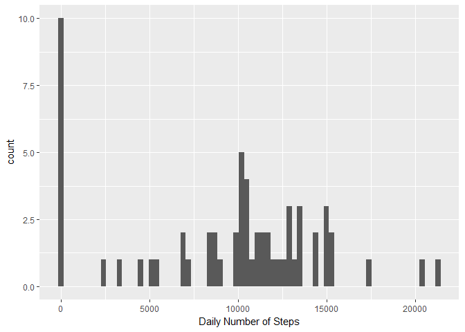
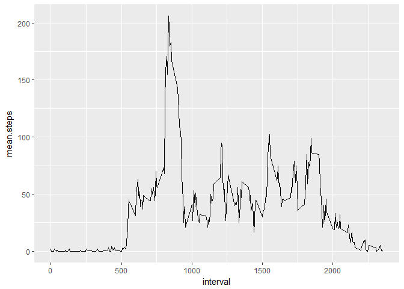
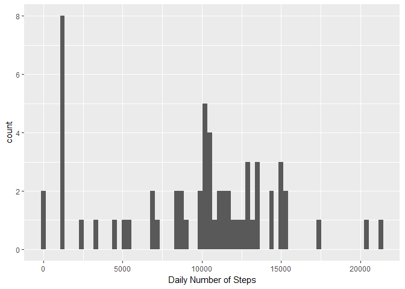
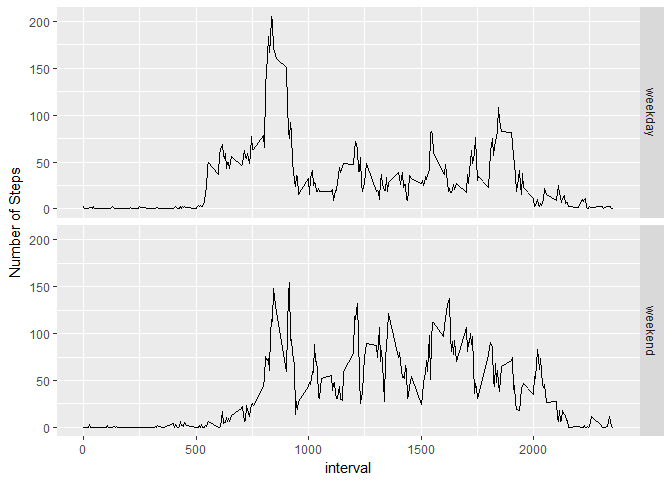

Activity Tracker
================
Bijo Jose
January 30, 2017

Introduction
------------

This assignment makes use of data from a personal activity monitoring device. This device collects data at 5 minute intervals through out the day. The data consists of two months of data from an anonymous individual collected during the months of October and November, 2012 and include the number of steps taken in 5 minute intervals each day.

The data for this assignment can be downloaded from the course web site:

Dataset: Activity monitoring data \[52K\] The variables included in this dataset are: steps: Number of steps taking in a 5-minute interval (missing values are coded as NA) date: The date on which the measurement was taken in YYYY-MM-DD format interval: Identifier for the 5-minute interval in which measurement was taken

The dataset is stored in a comma-separated-value (CSV) file.

``` r
library(knitr)
library(plyr)
library(ggplot2)
opts_chunk$set(dev="png", fig.path="figure/")


activity <- read.csv("activity.csv") # read in the data
activity$date <- as.POSIXct(activity$date) # set the dates to POSIXct
```

Calculate the total number of steps taken per day
=================================================

``` r
dailysteps <- aggregate(activity$steps, by = list(activity$date), sum, na.rm=TRUE) 
names(dailysteps) <- c("Date", "steps")

#Make a histogram of the total number of steps taken each day
qplot(steps, data = dailysteps, geom="histogram", xlab = "Daily Number of Steps", binwidth = 300)
```



Average daily activity pattern
==============================

``` r
#Calculate and report the mean and median of the total number of steps taken per day


mean.steps <- mean(dailysteps$steps) 
median.steps <- median(dailysteps$steps)
#df of the mean and median number of steps taken, averaged across all days (y-axis)
intsteps <- aggregate(activity$steps, by = list(activity$interval), mean, na.rm=TRUE)
intstepsmed <- aggregate(activity$steps, by = list(activity$interval), median, na.rm=TRUE)

intsteps <- cbind(intsteps[], intstepsmed$x)

#Tidy the df names and round the numbers
names(intsteps) = c("interval","mean.steps", "median.steps")
intsteps$mean.steps <- round(intsteps$mean.steps)
intsteps$median.steps <- round(intsteps$median.steps)


ggplot(intsteps, aes(x = interval, y = mean.steps)) + geom_line()
```



``` r
most.steps <- intsteps$interval[intsteps$mean.steps == max(intsteps$mean.steps)]
```

Imputing missing values
=======================

``` r
#find the NAs
na.steps <- subset(activity, is.na(steps))
num.NAs <-length(na.steps$steps)


#replace the NAs with the median number of steps for that period
nstps <- data.frame(date=activity$date[is.na(activity$steps)], interval = activity$interval[is.na(activity$steps)], steps=intsteps[match(intsteps$interval, activity$interval[is.na(activity$steps)]),3])

# remove the NA's from the period
activity <- subset(activity, !is.na(steps))

# Append the median steps to the Activity DF
activity <- rbind(activity, nstps)

#sum the number of steps each day into the dailysteps2 DF and get the mean and median 
dailysteps2 <- aggregate(activity$steps, by = list(activity$date), sum, na.rm=TRUE)
names(dailysteps2) <- c("Date", "steps")

qplot(steps, data = dailysteps2, geom="histogram", xlab = "Daily Number of Steps", binwidth = 300)
```



Differences in activity patterns between weekdays and weekends
==============================================================

``` r
mean.steps2 <- mean(dailysteps2$steps) 
median.steps2 <- median(dailysteps2$steps)

# Add the Weekday/weekend identifier

activity$week <- ifelse(weekdays(activity$date) == "Saturday" | weekdays(activity$date) == "Sunday" ,"weekend","weekday")

#df of the mean and median number of steps taken, averaged across all days (y-axis)
intsteps2 <- aggregate(activity$steps, by = list(activity$week, activity$interval), mean, na.rm=TRUE)
intstepsmed2 <- aggregate(activity$steps, by = list(activity$week, activity$interval), median, na.rm=TRUE)

intsteps2 <- cbind(intsteps2[], intstepsmed2$x)

#Tidy the df names and round the numbers
names(intsteps2) = c("weekday", "interval","mean.steps", "median.steps")
intsteps2$mean.steps <- round(intsteps2$mean.steps)
intsteps2$median.steps <- round(intsteps2$median.steps)


ggplot(intsteps2, aes(x = interval, y = mean.steps)) + ylab("Number of Steps") + geom_line() + facet_grid(weekday~.)
```


